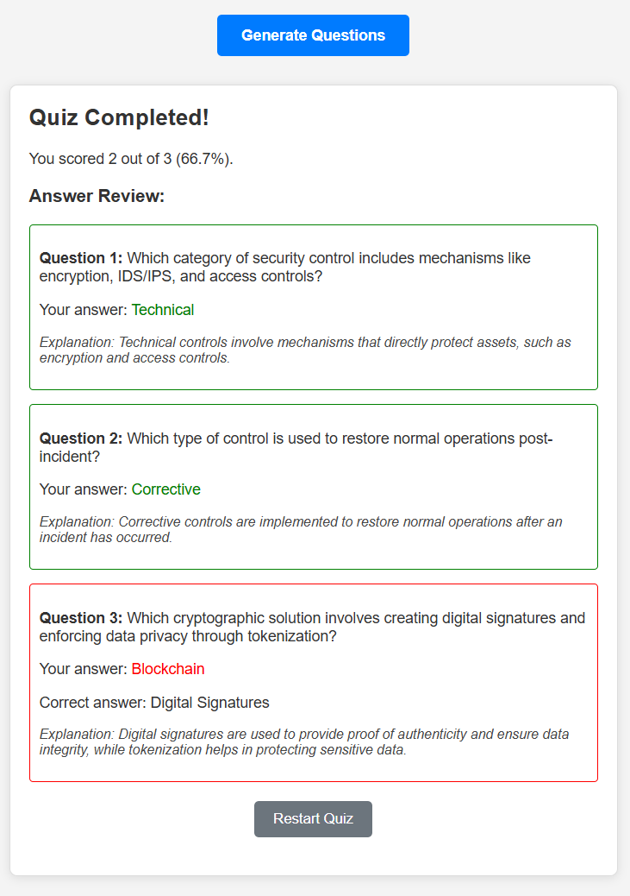

# QuizGenAI

QuizGenAI: A Node.js and AI-driven web app for generating multiple-choice questions from user-provided data, featuring a dynamic quiz interface.

<p align="left">
  
</p>

## Table of Contents

- [About The Project](#about-the-project)
- [Features](#features)
- [Built With](#built-with)
- [Getting Started](#getting-started)
  - [Prerequisites](#prerequisites)
  - [Installation](#installation)
- [Usage](#usage)
- [Results](#results)
- [Roadmap](#roadmap)
- [Contributing](#contributing)
- [Licence](#licence)
- [Contact](#contact)
- [Acknowledgements](#acknowledgements)

## About The Project

QuizGenAI allows users to input any textual information. Leveraging the power of AI (specifically OpenAI's GPT models), it parses the data to generate relevant multiple-choice questions. Users can then take these generated quizzes directly within the web application. This tool is designed to help students, educators, or anyone looking to quickly create assessments or learning checks from existing content.

## Features

*   **AI-Powered Question Generation:** Utilises OpenAI's API to create multiple-choice questions.
*   **Customisable Number of Questions:** Users can specify how many questions they want.
*   **Dynamic Quiz Interface:** Interactive quiz taking with immediate feedback.
*   **Score and Percentage Display:** Shows quiz results upon completion.
*   **Answer Review:** Users can review their answers against the correct ones and see explanations.
*   **Content Moderation:** Input text is checked for appropriateness before processing.
*   **Responsive Design:** Basic responsiveness for various screen sizes.
*   **(Future) Two-Pass AI Generation:** For more detailed and targeted questions.

## Built With

This project is built with the following major technologies:

*   **Frontend:**
    *   HTML5
    *   CSS3 (Custom)
    *   JavaScript (ES Modules)
*   **Backend:**
    *   Node.js
    *   Express.js
*   **AI:**
    *   OpenAI API (e.g., gpt-3.5-turbo)
*   **Key npm Packages:**
    *   `axios` (for API calls)
    *   `cors` (for Cross-Origin Resource Sharing)
    *   `dotenv` (for environment variables)
    *   `express` (web framework)
    *   `openai` (OpenAI Node.js library)
    *   `open` (to automatically open the browser)
    *   `nodemon` (for development server auto-restart)

## Getting Started

To get a local copy up and running, follow these simple steps.

### Prerequisites

*   Node.js and npm (Node Package Manager) installed. You can download them from [nodejs.org](https://nodejs.org/).
*   An active OpenAI API key. You can get one from [platform.openai.com](https://platform.openai.com/).

### Installation

1.  **Clone the repository:**
    (Replace `YourUsername` with your actual GitHub username)
    ```bash
    git clone https://github.com/svumo/QuizGenAI.git
    cd QuizGenAI
    ```
2.  **Install NPM packages:**
    ```bash
    npm install
    ```
3.  **Set up your Environment Variables:**
    *   Create a `.env` file in the root of the project.
    *   Add your OpenAI API key to this file:
        ```env
        OPENAI_API_KEY=YOUR_ACTUAL_OPENAI_API_KEY
        ```
    *   Refer to `.env.example` for the required structure.

## Usage

1.  **Start the server:**
    ```bash
    npm start
    ```
    Or for development with auto-reloading:
    ```bash
    npm run dev
    ```
    This will typically open the application in your default web browser at `http://localhost:5000`.

2.  **Using the App:**
    *   Paste the text material you want to generate questions from into the large textarea.
    *   Specify the number of questions you would like.
    *   Click "Generate Questions."
    *   Wait for the AI to process and generate the quiz.
    *   Take the quiz!

## Results 

This is the results and review page after you have completed the quiz. It shows your score, percentage, and a review of each question.

<p align="left">
  
</p>

## Roadmap

See the [open issues](https://github.com/svumo/QuizGenAI/issues) for a list of proposed features (and known issues). Future enhancements could include:
*   User accounts and saved quizzes.
*   Different question types (e.g., true/false, fill-in-the-blanks).
*   Exporting quizzes (PDF, text).
*   More advanced AI models or fine-tuning.
*   Improved UI/UX with a modern CSS framework (e.g., Tailwind CSS).

## Contributing

Contributions are what make the open-source community such an amazing place to learn, inspire, and create. Any contributions you make are **greatly appreciated**.

1.  Fork the Project
2.  Create your Feature Branch (`git checkout -b feature/AmazingFeature`)
3.  Commit your Changes (`git commit -m 'Add some AmazingFeature'`)
4.  Push to the Branch (`git push origin feature/AmazingFeature`)
5.  Open a Pull Request

Please make sure to update tests as appropriate.

## Licence

Distributed under the MIT Licence. See `LICENSE.txt` for more information.

## Contact

DanielPD - info@danielpd.com

Project Link: [https://github.com/svumo/QuizGenAI](https://github.com/svumo/QuizGenAI)

## Acknowledgements

*   OpenAI for their powerful language models.
*   Node.js & Express.js communities.
*   Any libraries or resources that were particularly helpful.
